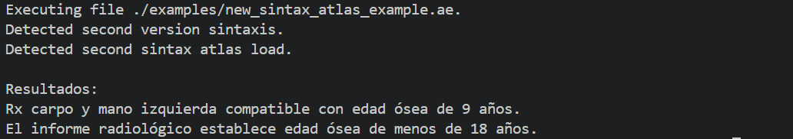

# Bone age estimator 

A program that reads a Domain Specific Language (DSL) file with a target radiography description (bone measurements) to be compared against a reference atlas of age labeled radiographies. Closest match to target results in it's labeled age being the final estimated age.

# How to use

## 1.- Install dependencies

Install Ruby (tested with v3.3) and then execute `bin/setup` or the following command:

```bash
bundle install
```

## 2.- Get an atlas

The [atlas/](atlas/) folder must contain the atlas referenced in the DSL file with the instructions. The name of the file will be used as the atlas name. So before writing the DSL file, make sure that the atlas is available at that location.

## 3.- Write the DSL file.

Write a DSL file that describes the target radiography. It can be either this syntax:

```ruby
DSLBoneAge.new do
  radiography name: 'Antonio'
  bone :radius, length: 21
  bone :ulna, length: 20

  atlas name: :atlas_basic_example, age: 8, genre: :male

  comparisons
  compare :radiographies
  age 9
  compare :radiographies
  show

  radiography name: 'Marcos'
  bone :radius, length: 20
  bone :ulna, length: 22

  comparisons
  compare :all
  show

  scoringSystem

  roi 'A', :radius, score: 5
  roi 'B', :ulna, score: 3
  mean
  show
end

```

or this:

```
  COMPARE THE RADIOGRAPHY OBSERVED BY Antonio 
  USING THE basicatlas ATLAS
  STARTING WITH GENDER male
  DEFINED BY
  A radius BONE OF MEASUREMENTS
  length = 21

```

## 4.- Execute the program

There is a [bin/boneage](bin/boneage) program that reads that file.

### Get the age estimation

Execute:

```bash
bin/boneage execute PATH
```

For example, for this instruction file:

```
COMPARE THE RADIOGRAPHY OBSERVED BY Juan
  USING THE simpleatlas ATLAS
  STARTING WITH GENDER male
  DEFINED BY
  A Radius BONE OF MEASUREMENTS
  length = 3

```

And given this atlas:

```
DEFINE A greulichPyle ATLAS NAMED mygreulichpyleatlas
  WITH THE FOLLOWING RADIOGRAPHIES
    ONE FOR GENDER male AGE 8 WITH
    A Radius BONE OF MEASUREMENTS
    length = 2.813

    ONE FOR GENDER male AGE 9 WITH
    A Radius BONE OF MEASUREMENTS
    length = 2.9

```

When executing it:

```bash
bin/boneage execute ./examples/new_sintax_atlas_example.ae
```

The output is:



### List available atlas

To see which atlas the program is able to find, execute:

```bash
bin/boneage list
```

For example, given these atlas:


When executing:

```bash
bin/boneage list
```

The result is:


### Help

Get a list of commands available by executing:

```bash
bin/boneage help
```

The result is:


