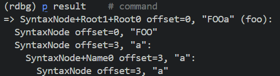

# Notes while trying to understand treetop

## Understanding the result of the parser

The parser's result is a `Treetop::Runtime::SyntaxNode` that contains the methods I defined in the root rule, which is the first rule definition in the grammar unless explicitly stated to be another rule.

For example, for the code:

```ruby

require 'treetop'
require_relative './lib/imagosproject/parser/basic_grammar.rb'

parser = MyGrammarParser.new
# content = %Q[
#   DEFINE foo
#   COMPARE

# ]
content = "FOOa"
result = parser.parse(content)
if !result
  puts parser.failure_reason
  puts parser.failure_line
  puts parser.failure_column
end
require 'debug'
binding.break
puts result.to_s

```

Where `MyGrammarParser`'s definition is:

```ruby

grammar MyGrammar
  rule root
    "FOO" name+ {
            def foo
              'test'
            end
          }
    # space* statement  {
    #                     def to_s
    #                       statement.to_s
    #                     end
    #                   }
  end

  rule space
    ("\n"+ / " "+)  {
                      def to_s
                        text_value
                      end
                    }
  end

  rule name
    ([a-zA-Z] / [0-9])+ {
                          def to_s
                            # (elements[0].map { |e| e.to_s}).join()
                            require 'debug'
                            binding.break
                            '2'
                          end
                        }
  end

  rule statement
    define_atlas statement* {
                              def to_s
                                define_atlas.to_s + '\n' +
                                  # elements[1].map do |e|
                                  #   e.to_s
                                  # end
                                  # .join('\n')
                                  ''
                              end
                            }
    /
    compare_radiography statement*  {
                                      def to_s
                                        compare_radiography.to_s + '\n' +
                                          # elements[1].map do |e|
                                          #   e.to_s
                                          # end
                                          # .join('\n')
                                          ''
                                      end
                                    }
  end

  rule define_atlas
    "DEFINE" space+ name space+ {
                                  def to_s
                                    elements[0].to_s
                                        # elements[1].map { |e| e.to_s }.join() +
                                        # '' +
                                        # elements[2].to_s
                                        # elements[3].map { |e| e.to_s }.join()
                                  end
                                }
  end

  rule compare_radiography
    "COMPARE" space+  {
                        def to_s
                          elements[0].text_value +
                              # elements[1].map { |e| e.to_s }.join()
                              ''
                        end
                      }
  end
end
```

The `result` is this AST:


And when `result.foo` is called it will return the return value of the `foo` method in my root rule.



## Understanding the +,*,? qualifiers

Every `+`, `*`, `?` is a `Treetop::Runtime::SyntaxNode`. Basically `elements` is always an array of `Treetop::Runtime::SyntaxNode` or `nil` if the sequence is terminal. I can see those qualifiers as an anonymous rule that does not output anything but rather simply control flow the rule, they are just like containers.

## Sequences with a single non-terminal are different

I ran into trouble with this rule:

```
  rule statement
    define_atlas  {
                    def value
                      require 'debug'
                      binding.break
                      elements[0].value
                    end
                  }
    /
    compare_radiography   {
                            def value
                              'radiography'
                              elements[0].value
                            end
                          }
  end

  rule define_atlas
    "DEFINE" space+ name  {
                            def value
                              require 'debug'
                              binding.break
                              elements[0].text_value +
                                  elements[1].elements.map { |node| node.value }
                                      .join() +
                                  elements[2].value
                            end
                          }
  end

  rule compare_radiography
    "COMPARE"   {
                  def value
                    elements[0].text_value
                  end
                }
  end
```

Because it turns out that if a sequence only has a non-terminal, in this case `define_atlas` or `compare_radiography` sequences, then it won't be wrapped, the `elements` method will directly return the `Treetop::Runtime::SyntaxNode` of the corresponding rule (in `define_atlas` that would be the "DEFINE" space+ name array of `Treetop::Runtime::SyntaxNode` instead of a single wrapper that makes available the value method)

The same happens with qualifiers, in the `name` rule:

```
  rule name
    ([a-zA-Z] / [0-9])+   {
                            def value
                              require 'debug'
                              binding.break
                              elements[0].elements.map do |node|
                                node.text_value
                              end.join()
                            end
                          }
  end
```

The `elements` is array of the definition inside `+` instead of a wrapper for it.

So basically there are inconsistensies in the treetop gem and I cannot trust it not to surprise me.
